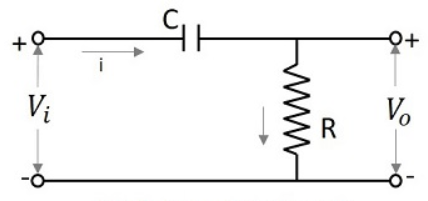
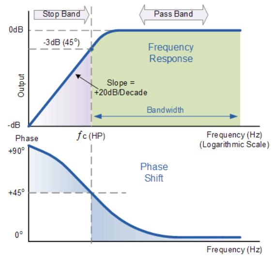
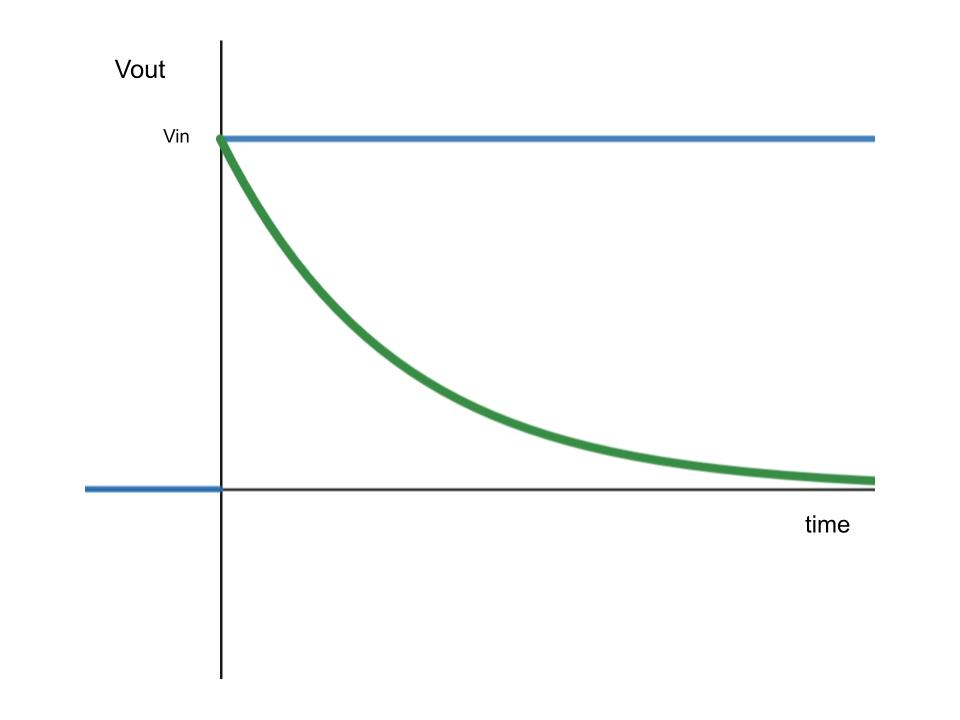

# Chapter 1

1. Linear Waveshaping circuits
2. Transistor Biasing

---
# Linear waveshapping circuits
waveshapping circuits that use linear elements (passive elements like R, C, L etc) are called Linear waveshaping circuits.

If we apply a sinusodal signal to the input of a linear waveshaping circuit , the output will be also a sinusodal signal where the amplitude and phase of the output will be determined by the circuit.
example : RL , RC , RLC circuits

another category of waveshaping circuits are non-linear wabeshapping circuits, here non-linear elements (active elements like diodes and transistor) will be present along with linear elements.

---
## Highpass RC
This circuit will pass only high frequencies

we know, the reactance of the capacitor is ,
$$
X_C = \frac{1}{j\omega c}
$$
so , we can say,
$$
X_C \propto \frac{1}{\omega}
$$
since $\omega = 2\pi f$ , we can say ,
$$
X_C \propto \frac{1}{f}
$$

Thus when frequency is low , the reactance of the capacitor will be very high , hence less current will be flow through the circuit and at high frequency the reactance will be low , so there will be a output .

### frequency responce
The cutoff frequency $f_c$ will be the point where the gain becomes -3db. we can measure gain in db with 
$$
Gain_{db}=20log\frac{V_{out}}{V_{in}}
$$

From the circuit ,
$$
V_{out}=iR \tag{1}
$$
$$
V_{in}=i\bigg(R+\frac{1}{j\omega C}\bigg) \tag{2}
$$
so gain is, $\frac{(1)}{(2)}$ ie.
$$
gain = \frac{R}{R + \frac{1}{j\omega C}} 
$$
substituing $\omega=2\pi f$ ,
$$
gain = \frac{R}{R + \frac{1}{j2\pi f C}} 
$$
taking R as common from denominator and moving j to nearby numerator,
$$
gain = \frac{1}{1 - \frac{j}{2\pi f RC}} 
$$
now lets keep, $\frac{1}{2\pi RC} = f_1$ , which is the cutoff frequency.
$$
gain = \frac{1}{1 - j\frac{f_1}{f}} 
$$
now we have a complex equation connecting gain and frequency, if we take the magnitude of this gain,
$$
|gain|=\frac{1}{\sqrt[2]{1+\big(\frac{f_1}{f}\big)^2}}
$$

using the above equation we can draw the frequency responce of High pass filter. 

>note : if we keep $f_1=f$  ,  we will get gain as $\frac{1}{\sqrt[2]{2}}$, the db equivalent of this is -3db

### Responce to step input

If we take a step signal of amplitude V we can denote it as ,
$$
u_{(t)}= \begin{cases} v & \quad t >0 \\ 0&\quad t<0 \end{cases}
$$
Since RC circuits cannot reflect sudden chanes in input , at $t=0$ , the output will be same as input, after that the input signal will be gradually used to charge the capacitor , so the output will start to decay exponentially. This decay will follow ,
$$
V_{out}=Ve^{\frac{-t}{RC}}
$$
at $t=1RC$ , output will be equal to input , at $t=3RC$ the output will be decayed by almost 95%.

### Responce to square input

[io graph image]

Lets take an input square wave with period $T$ , first half-cycle period $T_1$ and second half-cycle period $T_2$ .At the begining of $T_1$ the output will be same as input since the circuit cannot reflect sudden change in input. ie. at the start of $T_1$ , $V_{out} = V_{in}$ .
now comparing to the output voltage , the voltage across capacitor is less , hence the capacitor will charge using the input voltage and the output will start to decay following the equation 
$$
V_{out}=Ve^{\frac{-t}{RC}}
$$

At $T_2$ , the input drops by an amount V, since circuit cannot reflect sudden change in input , the output will also be same as input. 
now comparing the output voltage , the voltage across capacitor is high , hence it will discharge and the output will increase exponentially.

In the next period , this process will repeat , hence the output will be a tilted square wave.

#### Design equations 
$$
V_2 =  V_1e^\frac{-T_1}{RC} \tag{1} 
$$
$$
V_4 = V_3e^\frac{-T_2}{RC}
$$
$$
V=V_2-V_3 
$$
$$
V= V_1-V_4
$$
For a symmetrical square input , 
$$
T_1=T_2=\frac{T}{2}
$$
$$
V_1=V_3
$$
$$
V_2=V_4
$$
#### Percentage Tilt

As low frequencies are filtered, phase shifts are introduced which cause the leading edge of the square wave to rise and the trailing edge to fall at more of an angle. This produces a tilt to the top and bottom of the square wave. The tilt is usually expressed as a percentage of the peak amplitude of the square wave.

percentage tilt $T_p$ is given by,
$$
T_p = \frac{V_1-V_2}{\frac{V}{2}}
$$
substuting $(1)$ ,
$$
T_p = \frac{V_1-V_1e^\frac{-T_1}{RC}}{\frac{V}{2}}
$$
expanding $e^{-x}$ term and removing smaller terms within the expantion,
$$
T_p = V_1\bigg(\frac{1-\big(1 - \frac{T_1}{RC}\big)}{\frac{V}{2}}\bigg) = \frac{V_1 T_1 2}{RCV}
$$
if we consider symmetrical square wave, ie. $V_1 = \frac{V}{2}$ & $T_1=\frac{T}{2}$
$$
T_p=\frac{T}{2RC}
$$
in percentage,
$$
T_p=\frac{T}{2RC}\times100\%
$$
### RC Highpass circuit as a Differentiator

RC Highpass circuit can act as a differentiator under 2 conditions ,
1. $X_C >>> R$
2.  Angle of gain should be $90\degree$

When the first condition is met , most of the voltage drop happens across capacitor and most of the current will be across capacitor.

We know , 
$$
i = C\frac{dV_{in}}{dt}
$$
and $V_{out} = iR$
so,
$$
V_{out}=RC\frac{dV_{in}}{dt}
$$
from the above equation we can see that the output voltage is propotional to the derivative of the input voltage , hence the name differentiator.

We also know , 
$$
gain = \frac{1}{1-\frac{j}{2\pi fRC}}
$$
this is a complex value , and the angle of gain will be,
$$
\angle gain=-tan^{-1}\bigg(\frac{-1}{2\pi fRC}\bigg)
$$
applying condition 2 , this angle should be $90\degree$ , but if we do so the $2\pi fRC$ term must be infinity , which is not realizable , hence we will go for a nearby value , say $89.42\degree$ ,since, $tan^{-1}(100) = 89.42\degree$

ie. 
$$
100 \ge \frac{1}{2\pi fRC}
$$
or 
$$
RC \le \frac{T}{200\pi}
$$
ie. 
$$
RC \le 0.0016T
$$
An RC circuit should follow this condition this condition to act as a differentiator.

If we apply a square input to a differentiator , the output will be a spike signal , this happens because the RC time constant is very low so the capacitor will charge and discharge rapidly making the tilted square wave output to be a spike output.we can use this output signal in various other circuits as a trigger signal.

[spike output image]

