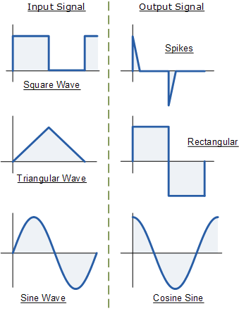
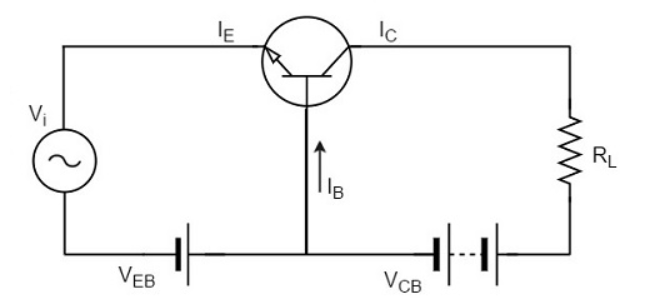

# Chapter 1

1. Linear Waveshaping circuits
2. Transistor Biasing

---
# Linear waveshapping circuits
waveshapping circuits that use linear elements (passive elements like R, C, L etc) are called Linear waveshaping circuits.

If we apply a sinusodal signal to the input of a linear waveshaping circuit , the output will be also a sinusodal signal where the amplitude and phase of the output will be determined by the circuit.
example : RL , RC , RLC circuits

another category of waveshaping circuits are non-linear wabeshapping circuits, here non-linear elements (active elements like diodes and transistor) will be present along with linear elements.

---
## Highpass RC
This circuit will pass only high frequencies

we know, the reactance of the capacitor is ,
$$
X_C = \frac{1}{j\omega c}
$$
so , we can say,
$$
X_C \propto \frac{1}{\omega}
$$
since $\omega = 2\pi f$ , we can say ,
$$
X_C \propto \frac{1}{f}
$$

Thus when frequency is low , the reactance of the capacitor will be very high , hence less current will be flow through the circuit and at high frequency the reactance will be low , so there will be a output .

### frequency responce
The cutoff frequency $f_c$ will be the point where the gain becomes -3db. we can measure gain in db with 
$$
Gain_{db}=20log\frac{V_{out}}{V_{in}}
$$

From the circuit ,
$$
V_{out}=iR \tag{1}
$$
$$
V_{in}=i\bigg(R+\frac{1}{j\omega C}\bigg) \tag{2}
$$
so gain is, $\frac{(1)}{(2)}$ ie.
$$
gain = \frac{R}{R + \frac{1}{j\omega C}} 
$$
substituing $\omega=2\pi f$ ,
$$
gain = \frac{R}{R + \frac{1}{j2\pi f C}} 
$$
taking R as common from denominator and moving j to nearby numerator,
$$
gain = \frac{1}{1 - \frac{j}{2\pi f RC}} 
$$
now lets keep, $\frac{1}{2\pi RC} = f_1$ , which is the cutoff frequency.
$$
gain = \frac{1}{1 - j\frac{f_1}{f}} 
$$
now we have a complex equation connecting gain and frequency, if we take the magnitude of this gain,
$$
|gain|=\frac{1}{\sqrt[2]{1+\big(\frac{f_1}{f}\big)^2}}
$$

using the above equation we can draw the frequency responce of High pass filter. 

>note : if we keep $f_1=f$  ,  we will get gain as $\frac{1}{\sqrt[2]{2}}$, the db equivalent of this is -3db

### Responce to step input

If we take a step signal of amplitude V we can denote it as ,
$$
u_{(t)}= \begin{cases} v & \quad t >0 \\ 0&\quad t<0 \end{cases}
$$
Since RC circuits cannot reflect sudden chanes in input , at $t=0$ , the output will be same as input, after that the input signal will be gradually used to charge the capacitor , so the output will start to decay exponentially. This decay will follow ,
$$
V_{out}=Ve^{\frac{-t}{RC}}
$$
at $t=1RC$ , output will be equal to input , at $t=3RC$ the output will be decayed by almost 95%.

### Responce to square input

[io graph image]

Lets take an input square wave with period $T$ , first half-cycle period $T_1$ and second half-cycle period $T_2$ .At the begining of $T_1$ the output will be same as input since the circuit cannot reflect sudden change in input. ie. at the start of $T_1$ , $V_{out} = V_{in}$ .
now comparing to the output voltage , the voltage across capacitor is less , hence the capacitor will charge using the input voltage and the output will start to decay following the equation 
$$
V_{out}=Ve^{\frac{-t}{RC}}
$$

At $T_2$ , the input drops by an amount V, since circuit cannot reflect sudden change in input , the output will also be same as input. 
now comparing the output voltage , the voltage across capacitor is high , hence it will discharge and the output will increase exponentially.

In the next period , this process will repeat , hence the output will be a tilted square wave.

#### Design equations 
$$
V_2 =  V_1e^\frac{-T_1}{RC} \tag{1} 
$$
$$
V_4 = V_3e^\frac{-T_2}{RC}
$$
$$
V=V_2-V_3 
$$
$$
V= V_1-V_4
$$
For a symmetrical square input , 
$$
T_1=T_2=\frac{T}{2}
$$
$$
V_1=V_3
$$
$$
V_2=V_4
$$
#### Percentage Tilt

As low frequencies are filtered, phase shifts are introduced which cause the leading edge of the square wave to rise and the trailing edge to fall at more of an angle. This produces a tilt to the top and bottom of the square wave. The tilt is usually expressed as a percentage of the peak amplitude of the square wave.

percentage tilt $T_p$ is given by,
$$
T_p = \frac{V_1-V_2}{\frac{V}{2}}
$$
substuting $(1)$ ,
$$
T_p = \frac{V_1-V_1e^\frac{-T_1}{RC}}{\frac{V}{2}}
$$
expanding $e^{-x}$ term and removing smaller terms within the expantion,
$$
T_p = V_1\bigg(\frac{1-\big(1 - \frac{T_1}{RC}\big)}{\frac{V}{2}}\bigg) = \frac{V_1 T_1 2}{RCV}
$$
if we consider symmetrical square wave, ie. $V_1 = \frac{V}{2}$ & $T_1=\frac{T}{2}$
$$
T_p=\frac{T}{2RC}
$$
in percentage,
$$
T_p=\frac{T}{2RC}\times100\%
$$

### RC Highpass circuit as a Differentiator

RC Highpass circuit can act as a differentiator under 2 conditions ,
1. $X_C >>> R$
2.  Angle of gain should be $90\degree$

When the first condition is met , most of the voltage drop happens across capacitor and most of the current will be across capacitor.

We know , 
$$
i = C\frac{dV_{in}}{dt}
$$
and $V_{out} = iR$
so,
$$
V_{out}=RC\frac{dV_{in}}{dt}
$$
from the above equation we can see that the output voltage is propotional to the derivative of the input voltage , hence the name differentiator.

We also know , 
$$
gain = \frac{1}{1-\frac{j}{2\pi fRC}}
$$
this is a complex value , and the angle of gain will be,
$$
\angle gain=-tan^{-1}\bigg(\frac{-1}{2\pi fRC}\bigg)
$$
applying condition 2 , this angle should be $90\degree$ , but if we do so the $2\pi fRC$ term must be infinity , which is not realizable , hence we will go for a nearby value , say $89.42\degree$ ,since, $tan^{-1}(100) = 89.42\degree$

ie. 
$$
100 \ge \frac{1}{2\pi fRC}
$$
or 
$$
RC \le \frac{T}{200\pi}
$$
ie. 
$$
RC \le 0.0016T
$$
An RC circuit should follow this condition this condition to act as a differentiator.

If we apply a square input to a differentiator , the output will be a spike signal , this happens because the RC time constant is very low so the capacitor will charge and discharge rapidly making the tilted square wave output to be a spike output.we can use this output signal in various other circuits as a trigger signal.

---
## Lowpass RC
This circuit will only pass low frequency signals.

[highpass circuit]

we know, the reactance of the capacitor is ,
$$
X_C = \frac{1}{j\omega c}
$$
so , we can say,
$$
X_C \propto \frac{1}{\omega}
$$
since $\omega = 2\pi f$ , we can say ,
$$
X_C \propto \frac{1}{f}
$$

Thus when frequency is low , the reactance of the capacitor will be very high , hence capacitor will act as a short circuit , hence less voltage will be available at output. at high frequency the reactance will be low , and because of that capacitor will act as an open circuit, so we will get more voltage at output .

### frequency responce

From the circuit ,
$$
V_{out}=iX_C=i\big(\frac{1}{j\omega C}\big) \tag{1}
$$
$$
V_{in}=i\bigg(R+\frac{1}{j\omega C}\bigg) \tag{2}
$$
so gain is, $\frac{(1)}{(2)}$ ie.
$$
gain = \frac{\frac{1}{j\omega C}}{R + \frac{1}{j\omega C}} 
$$
we can simplify this equation as,
$$
gain = \frac{1}{1 + \frac{j}{2\pi f RC}} 
$$
now lets keep, $\frac{1}{2\pi RC} = f_2$ , which is the cutoff frequency.
$$
gain = \frac{1}{1 + j\frac{f}{f_2}} 
$$
now we have a complex equation connecting gain and frequency, if we take the magnitude of this gain,
$$
|gain|=\frac{1}{\sqrt[2]{1+\big(\frac{f}{f_2}\big)^2}}
$$

using the above equation we can draw the frequency responce of High pass filter. 

[Frequency responce of LP]

>note : if we keep $f_1=f$  ,  we will get gain as $\frac{1}{\sqrt[2]{2}}$, the db equivalent of this is -3db

### Responce to step input

[LP responce to step image]

Assuming the initial voltage in capacitor as 0 , at $t=0$ the capacitor will start to charge from 0 to $V$, since output is across this capacitor the output will be equal to the capacitor voltage.

we know the voltage in a capacitor 
$$
V_C = V_{final}-\big((V_{final}-V_{initial})e^{\frac{-t}{RC}}\big)
$$
since $V_{initial}=0,V_{final}=V$ and $V_C = V_{out}$,
$$
V_{out}=V(1-e^\frac{-t}{RC}) \tag{1}
$$

#### Rise time

It is the time taken for the output to change from 10% of the input voltage to 90% of the input voltage.
lets say, at $t=t_1 , V_{out}=10\% V_{in}$  and at $t=t_2 , V_{out}=90\% V_{in}$

using $(1)$ , at $t=t_1$
$$
\frac{10}{100}V=V(1-e^\frac{-t_1}{RC})
$$
ie. 
$$
e^\frac{t_1}{RC}=\frac{1}{0.9}
$$
taking log on both sides,
$$
\frac{t_1}{RC}ln(e) = ln(\frac{1}{0.9})
$$
ie.
$$
t_1=0.1RC \tag{2}
$$
Similarly at $t=t_2$,
$$
e^\frac{t_2}{RC}=\frac{1}{0.1}
$$
taking log on both sides,
$$
\frac{t_2}{RC}ln(e) = ln(\frac{1}{0.1})
$$
ie.
$$
t_2 = 2.3RC
$$
so we can define rise time $t_r$ as ,
$$
t_r = 2.2RC
$$
### Responce to square input

[Square wave to LP]
Lets assume before $t=0$,the circuit already receives a reqgative square wave and the capacitor is at discharging state, not at $t=0$ ,lets say the voltage is $V_1$.
During $T_1$ the input is a positive square wave , so the capacitor will charge from $V_1$ to $V$ and the output will increase exponentially from $V_1$ to $V$ following the equation,
$$
V_2=V-\big((V-V_1)e^\frac{-T_1}{RC}\big)
$$
similarly during $T_2$
$$
V_1=-V-\big((-V-V_2)e^\frac{-T_2}{RC}\big)
$$
For a symmetric wave we can say $T_1=T_2=\frac{T}{2}$ and $V_1=-V_2$

### RC Lowpass circuit as an Integrator

For an RC Lowpass circuit to work as an Integrator , there are 2 conditions,
1. $R >>> X_C$
2. Angle of gain should be $90\degree$
We know ,
$$
i=C\frac{dV}{dt}
$$
Integrating both sides,
$$
V_{out}=\frac{1}{C}\int idt \tag{1}
$$
We are using $V_{out}$ since it is the voltage across the capacitor,

now applying condition $(1)$,most of the current will be available across R,ie.
$$
i=\frac{V_{in}}{R}
$$
Applying this in $(1)$,
$$
V_{out}=\frac{1}{RC}\int{V_{in}}dt
$$
Here we can see that the output voltage is the integral of input voltage

We know,
$$
gain=\frac{1}{1+j\omega RC}
$$
and 
$$
\angle gain = -tan^{-1}(2\pi fRC)
$$
If we apply condition $(2)$, the $2\pi fRC$ term should become 0 , which is not realizable , hence we will go for $89.42\degree$ instead of $90\degree$, which is the inverse tan of 100.
ie.
$$
100 \le 2\pi fRC
$$
or,
$$
RC \ge 16T
$$
##### Square wave input to an integrator 
since RC is very large charging and discharging will be in a linear way, so the output will be a triangular wave.

[sqr to triangle]

## Transistor Biasing
Biasing is the process of providing DC voltage which helps in the functioning of the circuit. A transistor is based in order to make the circuit operate in the desired region (Active/linear region in most cases).

#### Need For Biasing in a Transistor

- Biasing will ensure the operation of transistor in correct region.
- It stabilizes the circuit against eternal variations.
- In case of amplification , it will provide proper source and amplifies the weak signal faithfully
- Shape of the waveform will be preserved from input to output
### Q-point
Q-point is an imaginary point on the transfer curve of a transistor. For a transistor to be operated as a faithful amplifier, the operating point should be stabilized.

The main factor that affect the operating point is :

-  Variations in temperature (most important)
-  Fluctuations in power supply
-  Aging of components
  
As temperature increases, the values of $I_{CE}$ , $\beta$ and  $V_{BE}$ gets affected.

-   $I_{CBO}$ (collector leakage current) gets doubled (for every $10^\circ$ rise)
-   $V_{BE}$ decreases by 2.5mv (for every $1^\circ$ rise)

The below equations shows the dependency of  temperature in $I_C$
$$
\begin{align}I_C=βI_B+I_{CEO}\\I_C=βI_B+(β+1)I_{CBO}\end{align}
$$

As the temperature increases $I_C$ increases , this causes heat dissipation which in turn increases the temperature again , if the transistor is not stabilized , this cumulative effect will eventually result in the destruction of the transistor , this effect is called as the thermal runaway.
### Stabilization

The process of making the operating point independent of temperature changes or variations in transistor parameters is known as Stabilization. The extent to which a biasing circuit is successful in maintaining this is measured by Stability factor (S). Lower the value of S , better the stability.

Different stabilization factors are :

1. Variation of $I_C$ with $I_{CO}$  
$$
S={\frac{\delta I_C}{\delta I_{CO}} = {\frac{\Delta I_C}{\Delta I_{CO}}} = {\frac{(\beta + 1)}{(1- \beta\frac{dI_B}{dI_C})}}}
$$ where $I_{CO}$ is reverse saturation current

2. Variation of $I_C$ with $V_{BE}$ 
$$
S'={\frac{\delta I_C}{\delta V_{BE}} = {\frac{\Delta I_C}{\Delta V_{BE}}}}
$$

3. Variation of $I_C$ with $β$ 
$$
S''={\frac{\delta I_C}{\delta β} = {\frac{\Delta I_C}{\Delta β}}}
$$

Thus the variation of $I_C$ can be expressed as 
$$
\Delta I_C = (\ S\times\Delta I_{CO} \ )\ +(\ S'\times\Delta V_{BE} \ )\ +(\ S''\times\Delta \beta \ )\ 
$$

## Biasing Techniques
Transistor biasing can be classified into biasing using single power supply, and biasing using two power supply.
The first type is discussed here.
#### Fixed Bias

Here the transistor is driven from $V_{CC}$ through a resistor $R_B$ . Proper resistor values are picked for biasing the transistor. The stabilization is poor and Thermal runaway is not stopped with fixed bias.

equation for the base loop is, 
$$
V_{CC} = I_B R_B + V_{BE} \tag{1}
$$
also if we look at collector loop,
$$
V_{CC}=I_CR_C+V_{CE} \tag{2}
$$
we can solve $(1)$ and $(2)$ to find the q point.

we can neglect $V_{BE}$ from equation (1), $$R_B = \frac{V_{CC}}{I_B} \tag{3}$$here $V_{CC}$ is a fixed known quantity and $I_B$ is chosen at some suitable value. using those values we can find $R_B$ which is a constant.

now, we know , 
$$
I_C = \beta I_B + (\beta + 1)I_{CO}
$$
Substituting (3) and differentiating above equation with respect to $I_{CO}$ 
$$
S=\beta +1
$$
Which means $I_C$ varies $\beta +1$ times any change in $I_{CO}$

Alternatively , we know 
$$
S= {\frac{(\beta + 1)}{(1- \beta\frac{dI_B}{dI_C})}}
$$
in fixed bias $I_B$ is independent of $I_C$ 
$$
ie. \quad \frac {dI_B}{dI_C} = 0
$$
so, 
$$
S=\beta +1
$$

#### Collector to Base Bias

  

This is a modification to fixed bias circuit. Here instead of connecting $R_B$ to $V_{CC}$ , it is connected to collector.

  

![[CollectorToBaseBias.PNG]]

  

KVL on Base loop, 
$$
V_{CC} = I R_C + I_B R_B + V_{BE}
$$
$$
ie. \quad V_{CC} = (I_C + I_B)R_C + I_B R_B+ V_{BE} \tag{1}
$$
KVL on collector loop, $$V_{CC} = (I_C+I_B)R_C + V_{CE} \tag{2}$$
we can neglect $V_{BE}$ as it is small compared to $V_{CC}$ ,$$ I_B = \frac{V_{CC}-I_C R_C}{R_C + R_B} \tag{3}$$

substituting this in the equation $I_C = \beta I_B + (\beta + 1)I_{CO}$

$$I_C = \frac {\beta(V_{CC}-I_C R_C)}{R_C + R_B} +(\beta +1)I_{CO}$$

Differentiate this w.r.t to $I_{CO}$ ,$$S= \frac {\beta + 1}{1+\beta\frac{R_C}{R_C + R_B}}$$
Alternatively we can differentiate (3) with $I_C$ and substitute in the equation of S.

since the denominator is grater than unity , the final value will be less than $\beta +1$ , hence it will provide better stability than fixed-bias circuit.

#### Voltage Divider Bias / Potential Divider Bias

Here base is biased with a voltage divider network made of $R_1$ and $R_2$ . The resistor $R_E$ employed in the emitter provides stabilization.

![[VoltageDividerBias.PNG]]
Drawing the Thevenin's equivalent circuit

[equivalent circuit]

From the circuit.
$$
V_{BB}=V_{CC}\bigg(\frac{R_2}{R_1+R_2}\bigg)
$$
and 
$$
R_B=R_{th}=(R_1 \parallel R_2 )= \frac{R_1R_2}{R_1+R_2}
$$
taking input side,
$$
V_{BB}=I_BR_B+V_{BE}+(I_B+I_C)R_E \tag{1}
$$
and at outputside,
$$
V_{CC}=I_CR_C+V_{CE}+(I_B+I_C)R_E
$$

we can neglect $V_{BE}$ as it is very low compared to $V_{CC}$ and we can isolate $I_B$ in equation (1).
ie.
$$
I_B(R_B+R_E)= V_{BB}-I_CR_E
$$
so , 
$$
I_B=\frac{V_{BB}-I_CR_E}{R_B+R_E}
$$

we know $I_C=\beta I_B+(\beta+1)I_{CO}$ , substituting the value of $I_B$ in the equation and expanding,

$$
I_C=\frac{\beta V_{BB}}{R_B+R_E} - \frac{\beta I_CR_E}{R_B+R_E}+(\beta + 1)I_{CO}
$$
isolating $I_C$
$$
I_C\big(1 + \frac{\beta R_E}{R_B+R_E}\big)=\frac{\beta V_{BB}}{R_B+R_E} +(\beta + 1)I_{CO}
$$
ie. 
$$
I_C = \frac{\bigg(\frac{\beta V_{BB}}{R_B+R_E} +(\beta + 1)I_{CO}\bigg)}{(1 + \frac{\beta R_E}{R_B+R_E}}
$$
Differentiating this w.r.t $I_{CO}$ , we will get $S$
ie. 
$$
S=\frac{1}{1+\frac{\beta R_E}{R_B+R_E}}
$$

#### Advantage
- The stablity factor is improved compared to other biasing methords
- Thermal stablity is achived , because here $I_B$ reduces due to excess voltage drop across $R_E$ , this inturn reduces $I_C$ and the collector current is stablized.

 